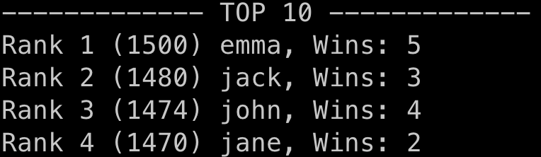
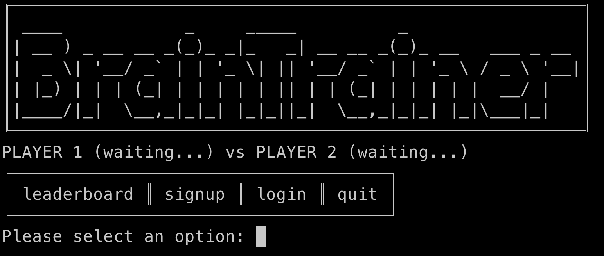
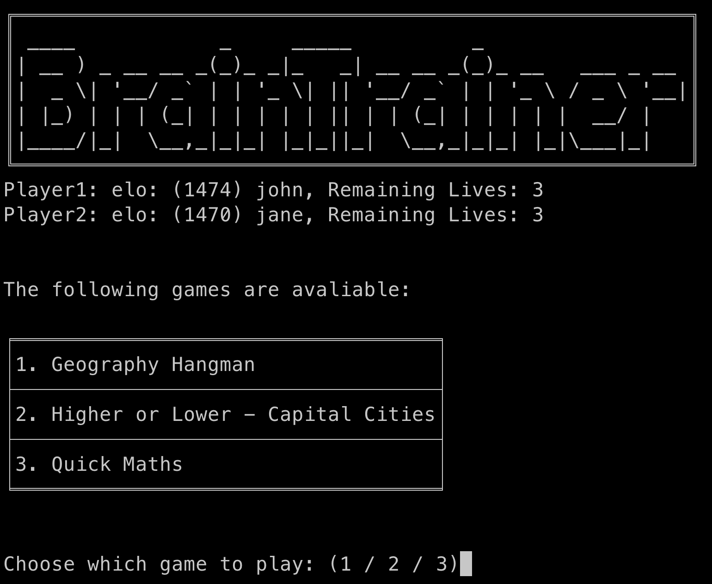

- # Prerequisites
  - Python 3.10 or newer
- # Installation
  - Download game.py 
  - Download game_data.csv
  - Download user_data.csv
- # Usage
  - Before starting the game, ensure that all files are kept within the same directory. 
  - Run the following command in terminal. 
  - ```shell
    python game.py
    ```
  - Enjoy the game!
  - The script will display a leaderboard consisting of top 10 players for a few seconds.  
    - 
  - Next, the program prompts player 1 to sign up or log in. Players can access the leaderboard or quit the program anytime they wish by entering the right command. Note: usernames are case-sensitive. 
    - 
  - After both player logs in, choose a game to play. Each player has 3 lives to begin the game.  
    - 
  - Enjoy the game! The player to lose all their lives will lose the match, and with it, their precious ELO ratings. Meanwhile, winners steal away these ELO points from the losers.  
- # Authors
  - Janel Lee Mei Er (1006978): janel_lee@mymail.sutd.edu.sg
  - Nathan Ansel (1007492): nathan_ansel@mymail.sutd.edu.sg
  - Safal Baral (1007110): safal_baral@mymail.sutd.edu.sg
  - Sam Siong Yahn Sean (1006929): sean_sam@mymail.sutd.edu.sg
  - Tan Meng Teck (1007176): mengteck_tan@mymail.sutd.edu.sg
